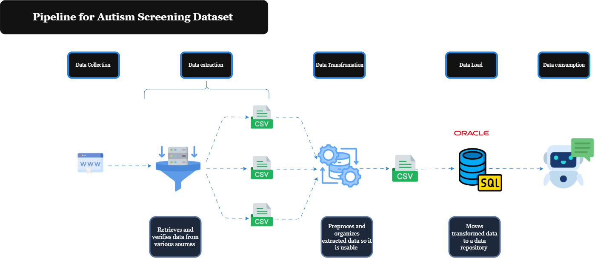

# Autism Screening Dataset - ETL Pipeline

This project implements an **ETL (Extract, Transform, Load) pipeline** to collect, clean, and load autism screening diagnostic data from multiple CSV sources into an Oracle database.

The final output is a **clean, unified dataset** stored in Oracle for analysis and machine learning applications.

---

## Overview

The pipeline consists of three main stages:

1. **Extract**  
   Download raw CSV files (Child, Adolescent, Adult datasets) from GitHub repository.

2. **Transform**  
   Clean and standardize the data: handle missing values, remove duplicates, fix typos, and merge datasets.

3. **Load**  
   Create database schema and load cleaned data into Oracle using SQL*Loader.




All steps are automated via a single script (`run_pipeline.bat` on Windows, `run_pipeline.sh` on Linux/macOS).

---

## Project Structure
```
Base_1_AUTISM_SCREENING/
│
├── AUTO_ETL/                              # Automated pipeline
│   ├── Code/
│   │   ├── Extract.py                    # Download data from GitHub
│   │   ├── Transform.py                  # Clean and merge datasets
│   │   └── Load.py                       # Load into Oracle database
│   ├── data/
│   │   ├── Autism-Child-Data.csv
│   │   ├── Autism-Adolescent-Data.csv
│   │   ├── Autism-Adult-Data.csv
│   │   └── Autism_test_clean.csv         # Final cleaned dataset
│   ├── Autism_Screening.ctl              # SQL*Loader control file
│   ├── run_pipeline.bat                  # Windows pipeline runner
│   └── run_pipeline.sh                   # Linux/Mac pipeline runner
│
├── EXTRACT/
│   └── Extract.py                        # Manual extraction script
│
├── TRANSFORM/
│   ├── Transform.py                      # Manual transformation script
│   └── Transform_notebook.ipynb          # Data exploration notebook
│
├── LOAD/
│   ├── Creation_Autism_Screening.sql    # Database schema
│   ├── Unit_Test_Autism_Screening.sql   # Database tests
│   └── Autism_Screening.ctl             # SQL*Loader control file
│
├── data/
│   ├── autism_screening_visualization.png
│   └── Autism_test_clean.csv
│
├── requirements.txt
└── README.md
```

---

## Data Sources

The pipeline collects data from:

- **[GitHub - CSV Dataset for Autism Diagnostics](https://github.com/shaheennamboori/CSV_dataset_for_autism_diagnostics)**
  - Autism-Child-Data.csv (292 rows)
  - Autism-Adolescent-Data.csv (104 rows)
  - Autism-Adult-Data.csv (704 rows)

**Total**: 1,100 rows → **946 rows** after cleaning

---

## Dataset Information

### Features (20 columns)

- **AQ-10 Screening Scores**: `a1_score` to `a10_score` (binary: 0/1)
- **Demographics**: `age`, `gender`, `ethnicity`, `country`
- **Medical History**: `jaundice` (born with jaundice), `autism` (family history)
- **Test Metadata**: `result` (total score 0-10), `relation` (who completed test)
- **Classification**: `class_asd` (ASD diagnosis: 0=No, 1=Yes), `age_group` (child/adolescent/adult)

### Data Quality

| Metric | Value |
|--------|-------|
| Original Records | 1,100 |
| Final Records | 946 |
| Missing Values Removed | 142 rows |
| Duplicates Removed | 9 rows |
| Age Outliers Removed | 1 row (age > 150) |
| Unique Countries | 82 |
| ASD Cases | 364 (38.5%) |
| Non-ASD Cases | 582 (61.5%) |

---

## Installation

### Prerequisites

- Python 3.8+
- Oracle Database (11g or higher)
- Oracle Instant Client (for SQL*Loader)

### Setup

1. **Create virtual environment**:
```bash
python -m venv venv
```

2. **Activate virtual environment**:

**Windows**:
```bash
venv\Scripts\activate
```

**Linux/Mac**:
```bash
source venv/bin/activate
```

3. **Install dependencies**:
```bash
pip install -r requirements.txt
```

4. **Configure Oracle connection**:

Edit `AUTO_ETL/Code/Load.py`:
```python
USERNAME = 'your_username'
PASSWORD = 'your_password'
CONNECTION_STRING = '//localhost:1521/your_service_name'
```

---

## Running the Pipeline

### Windows

1. Open **Command Prompt**
2. Navigate to `AUTO_ETL` folder:
```bash
cd AUTO_ETL
```

3. Run:
```bat
run_pipeline.bat
```

Or **double-click** `run_pipeline.bat` in File Explorer.

---

### Linux / macOS

1. Open terminal
2. Navigate to `AUTO_ETL` folder:
```bash
cd AUTO_ETL
```

3. Make script executable (first time only):
```bash
chmod +x run_pipeline.sh
```

4. Run:
```bash
./run_pipeline.sh
```

---

### What the Pipeline Does

The script automatically:

1. **Extracts** 3 CSV files from GitHub
2. **Transforms** data:
   - Standardizes column names
   - Removes duplicates and missing values
   - Cleans and standardizes country names
   - Converts data types
   - Merges all datasets
3. **Loads** data into Oracle:
   - Creates database table with constraints
   - Uses SQL*Loader for bulk insert
   - Validates data integrity

**Output**: Oracle table `autism_screening` with 946 records

---

## Manual Execution

Run each step separately for debugging:
```bash
cd AUTO_ETL

# Step 1: Extract
python Code/Extract.py

# Step 2: Transform
python Code/Transform.py

# Step 3: Load
python Code/Load.py
```

---

## Database Schema
```sql
CREATE TABLE autism_screening (
    id NUMBER PRIMARY KEY,
    a1_score - a10_score NUMBER(1) CHECK (BETWEEN 0 AND 1),
    age NUMBER CHECK (age > 0 AND age < 150),
    gender CHAR(1) CHECK (gender IN ('m', 'f')),
    ethnicity VARCHAR2(50),
    jaundice VARCHAR2(3) CHECK (jaundice IN ('yes', 'no')),
    autism VARCHAR2(3) CHECK (autism IN ('yes', 'no')),
    country VARCHAR2(200),
    result NUMBER CHECK (result >= 0),
    relation VARCHAR2(50),
    class_asd NUMBER(1) CHECK (class_asd IN (0, 1)),
    age_group VARCHAR2(20) CHECK (age_group IN ('child', 'adolescent', 'adult'))
);
```

---

## Testing

Validate database after loading:
```sql
-- Count records
SELECT COUNT(*) FROM autism_screening;

-- Distribution by age group
SELECT age_group, COUNT(*) FROM autism_screening GROUP BY age_group;

-- ASD diagnosis distribution
SELECT class_asd, COUNT(*) FROM autism_screening GROUP BY class_asd;
```

Or run unit tests:
```bash
sqlplus username/password@service @LOAD/Unit_Test_Autism_Screening.sql
```

---
